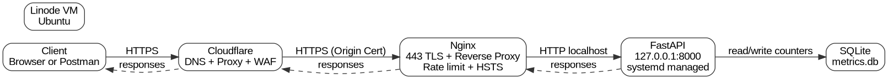

# API-Resume

Production-grade Resume API and build documentation site.

Live URLs
- API root: https://api.dealapiops.dev/
- Resume JSON: https://api.dealapiops.dev/resume
- Metrics: https://api.dealapiops.dev/metrics
- Docs site: https://docs.dealapiops.dev/

API endpoints
- GET /health
- GET /resume
- GET /resume.min
- GET /resume.txt
- GET /metrics
- GET /visit

Architecture
Client -> Cloudflare -> Linode -> Nginx -> FastAPI -> SQLite

What this project demonstrates
- FastAPI microservice design
- Reverse proxy isolation with Nginx
- Cloudflare proxy + Origin TLS (Full strict)
- systemd service management
- Firewall allowlist to Cloudflare IP ranges only
- Rate limiting and HSTS
- Simple telemetry (site visits + API call counters)

Security controls
- FastAPI binds to 127.0.0.1:8000 only
- Nginx terminates TLS and proxies to localhost
- Cloudflare Origin Certificate installed on the Linode
- Cloudflare SSL mode set to Full (strict)
- UFW restricts inbound 80 and 443 to Cloudflare IP ranges only
- Nginx rate limiting enabled
- HSTS header enabled

Project layout
- app.py
  FastAPI app with endpoints and counters
- resume.json
  Resume data in JSON Resume schema format
- docs-site/
  Static documentation website and architecture diagram
- metrics.db
  Local SQLite database for counters (not committed)

Local quick test (on the server)
- curl -s http://127.0.0.1:8000/health
- curl -s http://127.0.0.1:8000/resume | head

Public quick test
- curl -s https://api.dealapiops.dev/health
- curl -s https://api.dealapiops.dev/resume | head
- curl -s https://api.dealapiops.dev/metrics

Notes
- Do not commit TLS keys or Cloudflare origin cert private keys.
- metrics.db is stateful and should not be committed.

